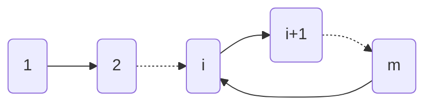

<embed src="/files/II-Final-AB.pdf" width="820" height="1000" 
 type="application/pdf">

---

{}

**Problem C: 实况足球**

有一个 $n$ 个点 $m$ 条边的带权无向图。$q$ 次询问，第 $i$ 次询问从点 $x_i$ 出发，每步交替移动到最远邻居和最近邻居，共移动 $k_i$ 步，求移动总距离。

* 对于 $40\\%$ 的分数：$k\leq 100$。
* 对于另外 $40\\%$ 的分数：$n\leq 100$。
* 对于 $100\\%$ 的分数：$n, k, q\leq 10^5$。

{}

**$40\\%$ 分数的解法**

由于 $k\leq 100$，所以我们可以模拟完整的移动流程，只需为图上的每个点预处理最远的邻居和最近的邻居，然后模拟即可。假设 $n, m, q$ 同阶 (后续的复杂度分析类似)，总时间复杂度 $O(nk)$。

**$80\\%$ 分数的解法**

令 `(球员编号,0/1)` 这个状态表示当前球在谁的脚下且下一步是短传还是长传，以所有这样的状态为点建一个新图。如果编号为 $i$ 的球员在短传时目标球员是 $j$，则在 `(i, 0)` 和 `(j, 1)` 之间连一条有向边，长传的情况类似。容易发现这样一张图完整地刻画了传球的情况，且它只有 $2n$ 个点，每个点有且仅有一条出边。一个形如 $(x_i, k_i)$ 的询问只需要在这张新图上从点 `(xi, 1)` 出发连走 $k_i$ 步计算距离之和。

额外 $40\\%$ 的分数满足 $n\leq 100$，这意味着新图节点也很少。所以虽然 $k$ 可能很大，但根据鸽巢原理，走超过 $2n$ 步之后我们一定会进入一个之前走过的状态，也就是说我们会在一个环中兜圈，如下图所示 (虚线箭头代表省略了中间的部分节点)：

因此我们只要尝试性地走若干步识别出这个环，然后用数学方法计算出在这个环上绕多少圈，最后再手动模拟剩余的不足一圈的步数即可。时间复杂度为 $O(n^2)$。

**$100\\%$ 分数的解法**

在“倍增”章节中我们曾说：倍增适用于“有固定的下一个状态”的场合，在树上求 LCA 时，这点体现为每个点有唯一的父亲。这里由于新图中每个点有且仅有一条出边，所以也适合用倍增处理移动问题。

令 $to(i, j)$ 表示新图上从点 $i$ 出发，走 $2^j$ 步后到达的节点编号，$sum(i, j)$ 表示新图上从点 $i$ 出发，走 $2^j$ 步经过的路程之和，这两个都是可以高效计算的：

$$
to(i, j) = \begin{cases}
next(i)&, j = 0\\\\
to(to(i, j-1), j-1)&, j > 0
\end{cases}
$$

$$
sum(i, j) = \begin{cases}
w(i, next(i))&, j = 0\\\\
sum(i, j - 1) + sum(to(i, j-1), j-1)&, j > 0
\end{cases}
$$

对于任意的 $k$，只要将其分解成若干个2的次幂相加的形式，然后累加对应的 sum 即可。时间复杂度为 $O(n\log k)$。

---

{}

**Problem D: 排序代价**

对于一个数列 $s$，每次可以选定一个区间 $[l, r]$ 并花费 $r-l+1$ 的代价将区间中的数排序，将 $s$ 完全排序的最小代价记为 $cost(s)$。现给定数列 $S$，求
$$
\sum_{s是S的子串}cost(s)
$$

{}

首先可以发现一个性质：对于任何一个子串 $s$，最优的排序方案应该满足选择的区间两两不相交。这是因为如果两个区间相交，我们总可以将其换成这两个区间的并集，这个区间的代价比两个区间的代价和更小且效果与两个区间相同。又因为给 $[l, r]$ 排序的代价正好等于其长度 $r-l+1$，所以在子串中，我们每能找到一个数不被覆盖，我们就能为最终的代价节省 $1$。

综合以上分析，我们可以得出结论：要最小化子串的代价之和，我们只要**对于每个元素 $s_i$，计算它在多少个子串的排序过程中可以不被区间覆盖，记为 $f(i)$**，最后用所有子串的总长减去计数的结果即可。

接下来我们考虑一个元素在区间排序的过程中不被覆盖的充分必要条件是什么。考场上有大量的同学询问 `4 3 1` 的排序代价为何是 3 而不是 2，这是因为虽然 3 在正确的位置，但 1 和 4 “站错边”了，想要将 1 和 4 排到正确的位置不可能通过选择不包括 3 的区间实现。结合这个样例，我们可以发现：数列 $s_1, \cdots, s_n$ 中 $s_k$ 可以在排序中不被覆盖的充要条件是
$$
\forall i\in [1, n], (i - k)(s_i - s_k) \geq 0
$$
用人话来说，就是在 $s_k$ 左边的数都小于等于它，在 $s_k$ 右边的数都大于等于它。这样我们就可以对 $[1, k-1]$ 和 $[k+1, n]$ 局部地排序。

结合这个充要条件，我们可以得到计算 $f(i)$ 的方法：令 $l_i$ 为 $s_i$ 左侧第一个大于 $s_i$ 的数的位置 (若不存在这样的数则为 0)，$r_i$ 为 $s_i$ 右侧第一个小于 $s_i$ 的数的位置 (若不存在则为 $n+1$)，那么任意满足 $l_i\< l\leq i, i\leq r< r_i$ 的区间 $[l, r]$ 都是可以使 $s_i$ 不被覆盖的区间，从而 $f(i)=(i - l_i)(r_i - i)$。

最后的问题是如何计算 $l_i$ 和 $r_i$。以计算 $l_i$ 为例，计算的方法很多，一种可行的做法是将所有数按照从大到小的顺序加入 C++ set，每次使用 `lower_bound()` 方法寻找左侧最靠右的元素位置，类似于 II-HW-3A 的做法。该算法总复杂度为 $O(n\log n)$，虽然分析了很多，但实现起来其实非常简短。

{}

本题其实相当有难度，这是因为人很难克服惯性思维：题目中要对各个子串的最小代价求和，所以我们很自然地想对每个子串单独求代价，最后相加。将视角转化为对每个元素计算可以不在多少个区间中被覆盖，打破了原题中对总代价的划分方式，这步转化需要相当的功力。

这道题目的原型是 [Codeforces-1827B](https://codeforces.com/contest/1827/problem/B1)，区别在于原题中排序一个区间的代价不是 $r-l+1$，而是 $r-l$。这一点小小的差异对题目难度的影响其实是巨大的——因为排序一个区间的代价不等于区间的长度，所以“省下”一个元素不被覆盖的收益难以定义，从而原题更加复杂。感兴趣的同学可以去挑战一下。

{}