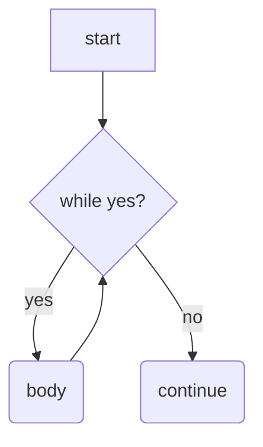
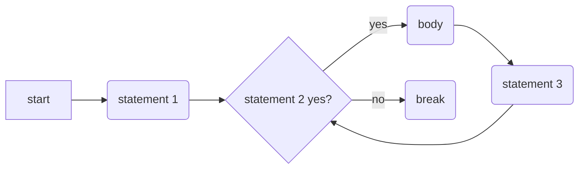

假设我们现在要计算 $1+2+3+...+10$，相信你已经有能力写出一段代码完成这个任务：

```c++
int sum;
sum = 1;
sum = sum + 2; // 你也可以写 sum += 2; 它们的功能是一样的
sum = sum + 3;
sum = sum + 4;
sum = sum + 5;
```

但是这样的代码看起来未免有些笨拙，如果我们要计算 $1+2+\cdots+100$，岂不是要写 100 行？当遇到这种需要大量重复做相同/相似操作的情况时，循环便能派上用场。while 循环的基本架构为：

```c++
while (condition)
{
    // your code here
}
```

在进入循环体之前，程序会先检查括号中的条件是否成立，如果成立就执行大括号中的内容，执行完内容后程序会再次判断括号中的条件是否成立……直到某次执行完循环体后条件不成立了，while 循环才会退出，下面的流程图很好地诠释了 while 循环的执行过程：



有了 while 循环后，我们可以容易地解决下面的这个问题：输入一个整数 $n$，输出 $1+2+\cdots+n$：

```c++
#include <bits/stdc++.h>

int main ()
{
    int n, sum;
    std::cin >> n;
    sum = 0;
    while (n != 0)
    {
        sum += n;
        n--; // "n--" is equal to "n = n - 1"
    }
    std::cout << sum << '\n';
    return 0;
}
```

上述 while 循环将判断条件放在开头，另有一种 do-while 循环框架将判断条件放在末尾：

```c++
do
{
    // your code
}
while (condition); // 这里要加分号！
```

do-while 循环一定会先执行循环体再检查条件，其他的部分和 while 循环没有区别。


除了 while 循环，for 循环也是一种常用的循环框架，不过 for 循环的格式相对复杂：

```c++
for (/* statement 1 */; /* statement 2 */; /* statement 3 */)
{
    // your code
}
```

C++ 语言的 for 循环中有 3 条语句，其执行顺序非常微妙 (这是 C/C++ 经常被吐槽的一个点)。用流程图可以比较清楚地解释执行的顺序：



如果你觉得这个流程比较复杂，也可以暂时不那么仔细地理解它，毕竟 while 循环可以做到 for 循环能做到的所有事情。不过你可以记住的是：

```c++
int i;
for (i = 1; i <= n; i++) {}
```

这样一个 for 循环可以让变量 `i` 分别取 $1, 2, \cdots, n$，然后退出循环。如果你把三条语句代入刚才的流程图，你会发现它确实是正确的。这样一个从 $1$ 枚举到 $n$ 的写法比 while 循环看上去简洁一些。

我们给出两个使用 for 循环实现计算 $1+2+\cdots n$ 的示例代码：

```c++
#include <bits/stdc++.h>

int main ()
{
    int n, sum;
    std::cin >> n;
    for (int i = 1; i <= n; i++)
        sum += i; // 别忘了单条语句可以不用{}包裹起来
    std::cout << sum << '\n';
    return 0;
}
```

如你所见，你可以在 for 循环中临时定义变量 `i`，这个变量 `i` 只可以在循环体中使用，在循环体以外你不能使用 `i`。

这个 for 循环的写法是之前介绍的比较规整的写法，下面是一个长相比较特别的 for 循环：

```c++
int main ()
{
    int n, sum;
    std::cin >> n;
    for ( ;n != 0; n--)
        sum = sum + n;
    std::cout << sum << '\n';
    return 0;
}
```

如果你代入之前的流程图理解 for 循环执行的过程，你会发现这个写法比较像 while 循环的逻辑。事实上，之所以说 for 循环完全可以用 while 循环代替，是因为

```c++
for (s1; s2; s3)
{
    // your code
}
```

等价于

```c++
s1;
while (s2)
{
    // your code
    s3;
}
```