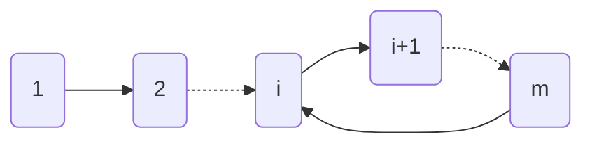

{}

**题意概述**

有一个 $n$ 个点 $m$ 条边的带权无向图。$q$ 次询问，第 $i$ 次询问从点 $x_i$ 出发，每步交替移动到最远邻居和最近邻居，共移动 $k_i$ 步，求移动总距离。

* 对于 $40\\%$ 的分数：$k\leq 100$。
* 对于另外 $40\\%$ 的分数：$n\leq 100$。
* 对于 $100\\%$ 的分数：$n, k, q\leq 10^5$。

{}

**$40\\%$ 分数的解法**

由于 $k\leq 100$，所以我们可以模拟完整的移动流程，只需为图上的每个点预处理最远的邻居和最近的邻居，然后模拟即可。假设 $n, m, q$ 同阶 (后续的复杂度分析类似)，总时间复杂度 $O(nk)$。

**$80\\%$ 分数的解法**

令 `(球员编号,0/1)` 这个状态表示当前球在谁的脚下且下一步是短传还是长传，以所有这样的状态为点建一个新图。如果编号为 $i$ 的球员在短传时目标球员是 $j$，则在 `(i, 0)` 和 `(j, 1)` 之间连一条有向边，长传的情况类似。容易发现这样一张图完整地刻画了传球的情况，且它只有 $2n$ 个点，每个点有且仅有一条出边。一个形如 $(x_i, k_i)$ 的询问只需要在这张新图上从点 `(xi, 1)` 出发连走 $k_i$ 步计算距离之和。

额外 $40\\%$ 的分数满足 $n\leq 100$，这意味着新图节点也很少。所以虽然 $k$ 可能很大，但根据鸽巢原理，走超过 $2n$ 步之后我们一定会进入一个之前走过的状态，也就是说我们会在一个环中兜圈，如下图所示 (虚线箭头代表省略了中间的部分节点)：

因此我们只要尝试性地走若干步识别出这个环，然后用数学方法计算出在这个环上绕多少圈，最后再手动模拟剩余的不足一圈的步数即可。时间复杂度为 $O(n^2)$。

**$100\\%$ 分数的解法**

在“倍增”章节中我们曾说：倍增适用于“有固定的下一个状态”的场合，在树上求 LCA 时，这点体现为每个点有唯一的父亲。这里由于新图中每个点有且仅有一条出边，所以也适合用倍增处理移动问题。

令 $to(i, j)$ 表示新图上从点 $i$ 出发，走 $2^j$ 步后到达的节点编号，$sum(i, j)$ 表示新图上从点 $i$ 出发，走 $2^j$ 步经过的路程之和，这两个都是可以高效计算的：

$$
to(i, j) = \begin{cases}
next(i)&, j = 0\\\\
to(to(i, j-1), j-1)&, j > 0
\end{cases}
$$

$$
sum(i, j) = \begin{cases}
w(i, next(i))&, j = 0\\\\
sum(i, j - 1) + sum(to(i, j-1), j-1)&, j > 0
\end{cases}
$$

对于任意的 $k$，只要将其分解成若干个2的次幂相加的形式，然后累加对应的 sum 即可。时间复杂度为 $O(n\log k)$。