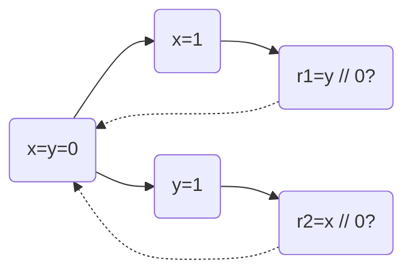
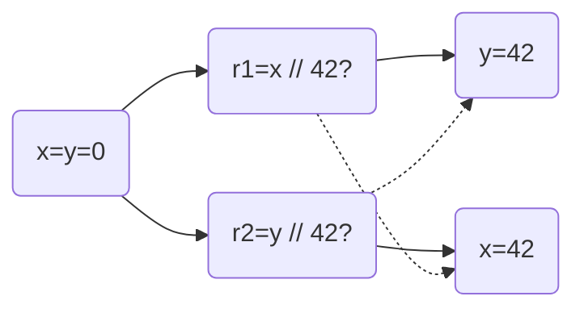
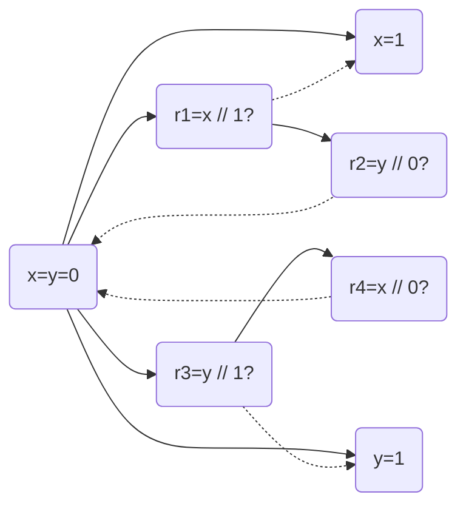
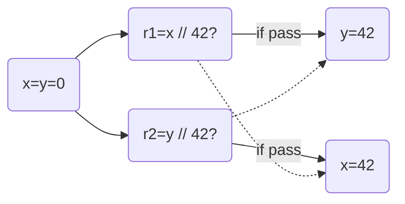

- [The Need of Weak Memory Model](#the-need-of-weak-memory-model)
- [Design Criteria](#design-criteria)
- [Happened-before Memory Model (HMM)](#happened-before-memory-model-hmm)
  - [Example: Store Buffering](#example-store-buffering)
  - [Example: Out-of-thin-Air Read](#example-out-of-thin-air-read)
  - [Example: Independent Reads of Independent Writes (IRIW)](#example-independent-reads-of-independent-writes-iriw)
  - [Example: HMM - No DRF guarantee.](#example-hmm---no-drf-guarantee)

Memory models define which reads see which writes. Sequential Consistency (SC) model is the simplest memory model: several threads' executions are interleaved (interleaving semantics), every read fetches the most recent write (full visibility).

## The Need of Weak Memory Model

SC mode prohibits many optimizations, e.g. store buffering

```c++
Initially: x = y = 0;
x = 1;   ||   y = 1;
r1 = y;  ||   r2 = x;
```

`r1 = r2 = 0` is impossible in SC model. However, compilers are unaware of concurrency and may adjust the order of statements, which violates SC model:

```c++
r1 = y;   #1 ||   y = 1;   #2
x = 1     #4 ||   r2 = x;  #3
```

SC model is inconsistent with the current compiler & architecture implementations. That's why we need weak memory models, which allow more behaviors.

## Design Criteria

**Usability**: DRF guarantee. DRF programs should have the same behaviors as in SC model. DRF stands for Data-Race-Freedom. A data race occurs when we have two concurrent conflicting operations.

* Conflicting: two operations both access the same memory location and at least one is a write.

* Concurrent: two operations are not ordered by "happens-before". Here "happens-before" varies under different memory models. In SC, "happens-before" means:
    * Program order: statement $S_1$ appears before $S_2$.
    * Synchronization-with: lock - unlock

**Implementability**: WMM cannot be too strong. It should be compatible with the mainstream compilers/architecture design:

* Allow common optimization techniques.
* Allow standard compilation schemes to major modern architectures.

That is, for an arbitrary code $C$, let $WMM(C)$ be the set of possible behaviors of $C$ under WMM, $Compiler(C)$ be the set of possible behaviors after compilation, $Compiler(C)\subseteq WMM(C)$ should hold.

However, WMM cannot be too week either. e.g., type-safety and security guarantee shall be preserved.

> **Compiler Optimization Can Be Smart**
>
> It's difficult to put forward a good WMM because optimizations are complex. For example,
>
> ```c++
> r1 = x;               ||  y = 2;
> r2 = x;               ||  x = r3;
> if (r1 == r2) y = 2;  ||
> ```
>
> The code can be optimized like this:
>
> ```c++
> y = 2;        // reorder
> r1 = x;
> r2 = r1;      // reduce memory access
> if (true);    // "r2 = r1" guarantees (r1 == r2)
> ```

## Happened-before Memory Model (HMM)

Program execution: a set of events, and some orders between them.

Happened-before order is the transitive closure of po (program order) and sw (synchronize-with). In HMM, a read can see

* The most recent write that happens before it.
* A write that has no happens-before relation.

In WMM, we consider declarative semantics, i.e., instead of constructing the execution, we firstly do assumptions on the result of reads, then we draw execution graph and check whether the result is reasonable.

### Example: Store Buffering



Assumption: `r1 = r2 = 0`, we find that `x = y = 0` is the most recent write that happens before `r1 = y` and `r2 = x`. Therefore the assumption is reasonable.

### Example: Out-of-thin-Air Read

Out-of-thin-air (OOTA) read means that the result is completely unreasonable.

```c++
Initially: x = y = 0;
r1 = x; | r2 = y;
y = r1; | x = r2;
assumption: r1 = r2 = 42;
```



Another understanding:

* Speculation: `r2` should be 42, which means that `y` needs to be 42.
* If `r2` equals 42, then in thread #2 `x` will be 42.
* If `x` equals 42, then in thread #1 `r1` will be 42.
* If `r1` equals 42, then in thread #1 `y` will be 42. -> cycle formed, justified!

OOTA reads should be prohibited, otherwise malicious inputs may challenge the safety of programming languages. Java's JMM spare great efforts to eliminate OOTA from HMM, resulting in JMM's complexity, and JMM may generate some surprising behaviors.

> **JMM's Suprising Behaviors - Example**
>
> ```c++
> C1;       ||                 lock I    ||
> lock I;   ||  C3;    ===>        C1;   ||  C3;
>     C2;   ||                     C2;   ||
> unlock I; ||                 unlock I; ||
> ```
>
> Adding more synchronization may increase behaviors!
>
> ```c++
> C1;  ||  C2  ||  C3;   ===>   C1;  ||  C3;
>                               C2;  ||
> ```
>
> Inlining threads may increase behaviors!

### Example: Independent Reads of Independent Writes (IRIW)

```c++
Initially: x = y = 0;
x = 1; || r1 = x; || r3 = y; || y = 1;
       || r2 = y; || r4 = x; ||
Assumption: r1 = 1, r2 = 0, r3 = 1, r4 = 0;
```

The assumption means that thread #2 shows `x=1` happens before `y=1` while thread #3 shows `y=1` happens before `x=1`, which is impossible in SC.



However, In HMM, it's allowed.

### Example: HMM - No DRF guarantee.

```c++
Initially: x = y = 0;
r1 = x;       ||  r2 = y;
if (r1 != 0)  ||  if (r2 != 0)
    y = 42;   ||      x = 42;
```

In SC, since both `if` statements yield false, the two threads have no data race and the program satisfies DRF property. However, in HMM, `r1 = r2 = 42` is possible, demonstrating that HMM doesn't have DRF guarantee:

