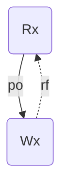
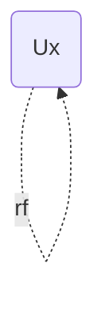
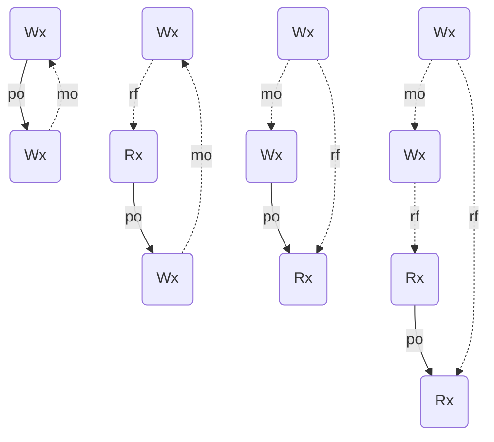
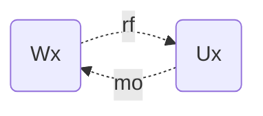
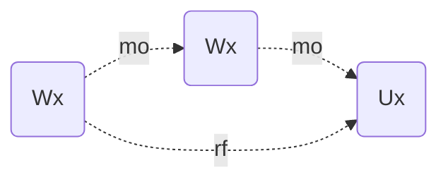
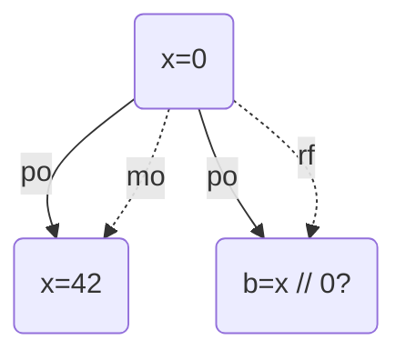
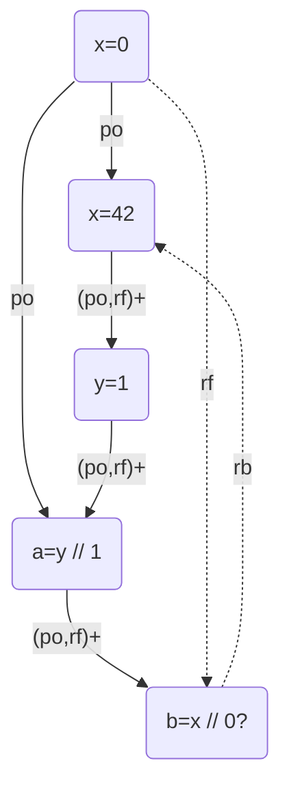
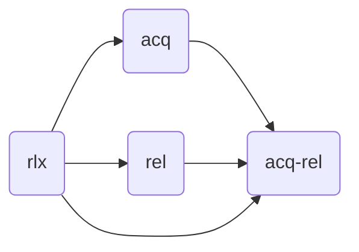

- [Overview](#overview)
- [Execution Graph](#execution-graph)
  - [Concepts](#concepts)
  - [Consistency Predicate](#consistency-predicate)
- [Sequential Consistency](#sequential-consistency)
- [Coherent Consistency](#coherent-consistency)
- [Release/Acquire Consistency](#releaseacquire-consistency)
- [Happen-before and C/C++11 Memory Model](#happen-before-and-cc11-memory-model)

## Overview

The basic procedure of declarative/axiomatic concurrency semantics:

* Define the notion of a program execution (generalization of an execution trace)
* Map a program to a set of executions
* Define a consistency predicate on executions
* Semantics = the set of consistent executions of a program

> **Exception: "catch-fire" semantics** 
>
> "catch-fire" semantics are those existing at least one "bad" consistent execution, which implies undefined behavior. (mainly appear in C/C++)

## Execution Graph

The vertices stands for the events in the program. There are 4 event types: read, write, update, fence. The edges represents relations between events. There are two relation types: program order `po` (also called sequenced-before, `sb`), and reads-from, `rf`. 

### Concepts

$\fbox{Definition}$ (label) A label has one of the following forms:
$$
R\space x\space v_r\qquad W\space x\space v_w\qquad U(x\space v_r\space v_w)\qquad F
$$
where $x\in \text{Loc}$ and $v_r,v_w\in \text{Val}$.

$\fbox{Definition}$ (event) An event is a triple $\langle id, i, l\rangle$ where

* $id\in \mathbb N$ is an event identifier.
* $i\in \text{Tid}\cup \{0\}$ is a thread identifier.
* $l$ is a label. 

Note: the thread identifier "0" is used for some initial statements that don't belong to any specific thread.

$\fbox{Definition}$ (execution graph) An execution graph is a tuple $\langle E, po,rf\rangle$, where

* $E$ is a finite set of events.
* $po$ (program order) is a partial order on $E$.
* $rf$ (reads-from) is a binary relation on $E$ such that
    * For every $\langle w,r\rangle\in rf$:
        * $\text{type}(w)\in \{W,U\},\text{type}(r)\in \{R, U\}$
        * $\text{loc}(w)=\text{loc}(r)$
        * $val_w=val_r$.
    * $rf^{-1}$ is a function, i.e., every read operation can read from only one write.

$\fbox{Definition}$ (sequential) An execution graph $G$ is called sequential if

* $\text{tid}(a)=0$ for every $a\in G.E$.
* $G.po$ is a total order on $G.E$.
* $G.rf=\emptyset$.

A sequential graph can be constructed from commands by the following rules:

Silent:
$$
\frac{c,s\overset{\epsilon}{\to}c',s'}{c,s,G\Rightarrow c',s',G}
$$
Non-silent:
$$
\frac{c,s\overset{l}{\to}c',s'\qquad a=\langle n,0,l\rangle\qquad n\notin \{\text{id}(b)|b\in G.E\}}{c,s,G\Rightarrow c',s',Add(a,G)}
$$
where $Add(a,G)$ yields an execution graph $G'$ givens by

* $G'.E=G.E\cup \{a\}$
* $G'.po=G.po\cup (G.E\times \{a\})$
* $G'.rf=G.rf$

$G$ is an execution graph of a command `c` with a final store `s` if $c,s_0,G_\emptyset\Rightarrow^*\mathbf{skip},s,G$.

### Consistency Predicate

The restriction of execution graph is quite loose. Given a program, we can draw a huge number of execution graphs satisfying the requirements above, but not all of them are reasonable. Therefore our goal is to define some consistency rules to specify "valid" execution graphs.

Let $X$ be some consistency predicate. We say an outcome $O$ is allowed for a program $P$ under $X$ if there exists an execution graph $G$ such that $G$ is X-consistent and $G$ belongs to $P$ with outcome $O$.

> **Exception: "catch-fire" semantics**
>
> or if there exists an execution graph $G$ such that $G$ is X-consistent, $G$ is an execution graph of $P$ and $G$ is "bad".

$\fbox{Definition}$ (completeness) An execution graph $G$ is called complete if $codom(G.rf)=G.R$, i.e., every read reads from some write.

## Sequential Consistency

$\fbox{Definition}$ (SC-consistent, Lamport) Let $sc$ be a total order of $G.E$, $G$ is called SC-consistent wrt (with respect to) $sc$ if

* If $\langle a,b\rangle\in G.po$, $\langle a, b\rangle \in sc$.
* If $\langle a, b\rangle\in G.rf$, then $\langle a,b\rangle\in sc$ and there does not exist $c\in G.W_{loc(b)}$ such that $\langle a,c\rangle\in sc$ and $\langle c,b\rangle\in sc$.

Notes: the first condition requires that program order should be consistent with the $sc$ total order. The second condition requires that a read should read from a write prior to it and there shouldn't be another write (on the same location) between them, i.e., read from the latest write.

There's an alternative version of SC-consistency:

$\fbox{Definition}$ (modification order) $mo$ is called a modification order for an execution graph $G$ if $mo=\bigcup_{x\in \text{Loc}}mo_x$, where each $mo_x$ is a total order on $G.W_x$.

$\fbox{Definition}$ (SC-consistent, alternative) An execution graph $G$ is called SC-consistent if the following hold:

* $G$ is complete.
* There exists a modification order $mo$ for $G$ such that $G.po\cup G.rf\cup mo\cup rb$ is acyclic.
    
    Here $rb\triangleq (G.rf^{-1};mo) -\{id\}$. The ";" operator means that if there exists $\langle a,c\rangle\in G.rf^{-1}$ and $\langle c,b\rangle\in mo$, then $\langle a,b\rangle\in rb$. The $\{id\}$ is used to filter out some dummy relations generated by $U$ (an operation $U$ reads from another write $W$ and $W\to U$ is also in $mo$.)

$\fbox{Theorem}$ The two SC definitions are equivalent.

Proof: 

* **Lamport SC $\Rightarrow$ alternative SC**: We've got an total order $sc$ which includes $po$ and $rf$, so we only need to construct $mo$. We let $mo\triangleq [W_x]; sc; [W_x]$. (Here $[W_x]$ is a tricky way of representing the starting node should belong to $G.W_x$.). Since $mo\subseteq sc$, we only need to proof that $rb$ won't generate circle with $sc$. Suppose the opposite, then the execution graph should be like

    ```mermaid
    graph TD
    W1 -->|rf| R
    W1 -->|mo| W2
    W2 -->|sc| R
    R -->|rb| W2
    ```

    which contradicts the property of $sc$ in Lamport SC's definition.

* **alternative SC $\Rightarrow$ Lamport SC**: We've got $po,rf,mo$. Let $sc$ be a total order satisfying $po\cup rf\cup mo\cup rb\subseteq sc$. ($po\cup rf\cup mo\cup rb$ is acyclic, so it's reasonable.) We need to prove that the total order $sc$ satisfies the second property in the definition. Suppose the opposite, i.e., there exists $\langle a,b\rangle, \langle a,c\rangle, \langle c,b\rangle\in sc$ and $\langle a,b\rangle\in rf,c\in G.W_{loc(b)}$, it's easy to discover that $b\overset{rb}{\to}c$ (the graph is the same as above), so $\langle b,c\rangle\in sc$, which contradicts the fact that $sc$ is an total order.

## Coherent Consistency

SC with interleaving semantics is (relatively) human-friendly, but it's expensive to implement SC on hardware. What's more, SC prohibits various optimization that are sound for sequential code. What most hardware guarantee and compilers preserve is "SC-per-location" (aka. coherence)

$\fbox{Definition}$ (coherent) an execution graph $G$ is coherent if the following hold:

* $G$ is complete.
* For every location $x$, there exists a total order $sc_x$ satisfying the Lamport SC's properties.

A few alternative definitions of coherence are shown below:

$\fbox{Definition}$ an execution graph $G$ is called coherent if the following hold:

* $G$ is complete.
* There exists a modification order $mo$ such that $G.po|_{loc}\cup G.rf\cup mo\cup rb$ is acyclic.

Note: $rf, mo,rb$ are naturally "per-location", here the notation $G.po|_{loc}$ means that we only consider program order edges on the same location.

Let's have a loot at some prohibited patterns:

No future read:



RMW-1 (can be triggered by an `CAS(x, 1, 1)` instruction):



coherence-ww/rw/wr/rr:



Note: with $rb$ edges, these graphs will have cycles.

RMW-2:



Atomicity:



This pattern illustrates that RMW event may only read from the immediate $mo$-predecessor - it has synchronization.

It can be proved that the bad patterns above cover all the cases of invalid execution graphs, so

$\fbox{Definition}$ an execution graph $G$ is coherent if $G$ is complete and there exists a modification order $mo$ satisfying:

* $rf;po$ is irreflexive (no-future-read)
* $mo;po$ is irreflexive (coherence-ww)
* $mo;rf;po$ is irreflexive (coherence-rw)
* $rf^{-1};mo;po$ is irreflexive (coherence-wr)
* $rf^{-1};mo;rf;po$ is irreflexive (coherence-rr)
* $rf$ is irreflexive (RMW-1)
* $mo;rf$ is irreflexive (RMW-2)
* $rf^{-1};mo;mo$ is irreflexive (RMW-atomicity)

## Release/Acquire Consistency

COH is often too weak. For example, the common implementation of spinlock fails to work in COH since the variables used in the lock have no relation with the variables used in the critical section:

```bash
lock(l):                          unlock(l):
    r := 0                            l := 0
    while not r do
        r := CAS(l, 0, 1)
```

```c++
Initially: x = y = 0;
lock(l);        ||  lock(l);
x = 1;          ||  y = 1;
a = y; /* 0 */  ||  b = x; /* 0 */       // store buffering is allowed even with spinlock!
unlock(l);      ||  unlock(l);
```

In addition, COH also doesn't support message passing:

```c++
Initially: x = y = 0;
x = 42;  ||  a = y;
y = 1;   ||  while (!a) a = y;          // Message passing: y = 1 ==> x = 42 is expected.
         ||  b = x; // 0                // b = 0 is allowable in COH!
```

The lesson we can learn from these examples is that the $rb$ relation in one variable should influence the global program order, i.e., $rb$ should serve as a synchronization. This leads to the RA memory model:

$\fbox{Definition}$ (RA-consistent) an execution graph $G$ is RA-consistent if it's complete and there exists a modification order $mo$ such that $(po\cup rf)^+|_{loc}\cup mo\cup rb$ is acyclic.

The subtle difference between $po|_{loc}\cup rf$ and $(po\cup rf)^+|_{loc}$ is that the latter allow $rf$ relation on one location to connect events on other locations. Let's check it on message passing example:

COH on `x` : allowed



RA on `x` : not allowed



In RA,  the $rf$ relation between `y=1` and `a=y` serves as a bridge that connects `x=42` and `b=x`. In this situation If `b=x` reads from `x=0`, the $rb$ edge generated will cause a cycle.

## Happen-before and C/C++11 Memory Model

We've already known that according to the strength, COH<RA<SC, but there's still some room between COH and RA: in the message passing example, we only need the $rf$ relation on `y` to have the synchronization effect and we don't care about `x`. The idea is that we can introduce access modes on variables:

```c++
x =(rlx) 42;  ||  a = y(rlx)
y =(rel) 1;   ||  while (!a) a = y;
              ||  a = y(acq)
              ||  b = x(rlx)
```

Each memory access has a mode:

* Reads: $\text{rlx}$ or $\text{acq}$.
* Writes: $\text{rlx}$ or $\text{rel}$.
* RMWs: $\text{rlx}$ or $\text{acq}$ or $\text{rel}$ or $\text{acq-rel}$.

The strength order can be represented as the following graph:



And we do synchronization only on $\text{rel/acq}$:
$$
\begin{align}
G.sw&\triangleq [W^{\supseteq\text{rel}}];G.rf;[R^{\supseteq \text{acq}}]\\\\
G.hb&\triangleq (G.po\cup G.sw)^+
\end{align}
$$
Here $W^{\supseteq \text{rel}}$ means the set of write events that have access mode not weaker than $\text{rel}$.

$\fbox{Definition}$ (C11 Consistency) an execution graph $G$ is C11-consistent if $G$ is complete and there exists a modification order $mo$ such that $hb_{loc}\cup rf\cup mo\cup rb$ is acyclic.

Note: the definition of RA-consistency doesn't need to additionally include $rf$ because the transitive closure $(po\cup rf)^+$ has include all the information in $rf$. However, in C11-consistency $hb_{loc}$ only consider $rf$ edges between "strong" r/w/rmw events so we still need to include $rf$.

The full C/C++11 memory model is more general in that it includes more access modes and fences.
