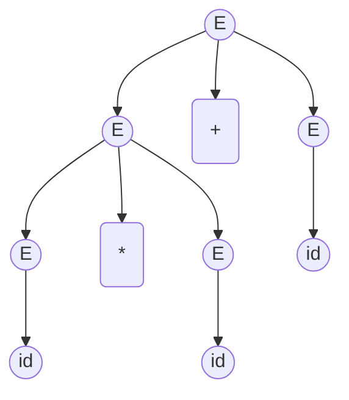

Regular expression is the weakest formal language. There are lots of languages that cannot be represented by regular expression. e.g. $\\{(^i)^i:i\geq 1\\}=\\{(),(()), ((())),...\\}$ (the set of balanced parentheses).

The parser takes the output of lexer, i.e. sequence of tokens as input, and outputs the parse tree of the program.

* Cool code: `if x = y then 1 else 2 fi`

* Parser input/lexer output: `IF ID = ID THEN INT ELSE INT FI`

* Parser output:

    ```bash
    IF-THEN-ELSE---+----=---+---ID
                   |        |
                   +---INT  +---ID
                   |
                   +---INT
    ```

## Context-Free Grammars

The parser must distinguish between valid and invalid strings of tokens. Therefore we need a language, and a method, for describing valid strings of tokens.

Programming languages have recursive structure, which makes parsing difficult, and context-free grammars are a natural notation for this recursive structure.

A CFG consists of

* A set of terminals, denoted as $T$.
* A set of non-terminals, denoted as $N$.
* A start symbol $s\in N$.
* A set of productions. Each production is of format $X\to Y_1,\cdots, Y_n$, where $X\in N$, $Y_i\in T\cup N\cup \{\epsilon\}$. Productions can be read as rules, meaning that LHS can be replaced by RHS.

Example: all balanced parentheses sequence: $T=\{(,)\},N=\{s\}$, two rules:
$$
\begin{align}
s &\to (s)\\\\
s &\to \epsilon
\end{align}
$$
The way to understand a CFG:

* Begin with a string with only the start symbol $S$.
* Replace any non-terminal $X$ in the string by the right-hand side of some production $X\to Y_1,\cdots Y_n$.
* Repeat (2) until there are no non-terminals.

Formally, we use $\alpha_1\overset{\*}{\to}\alpha_2$ to represent that string $\alpha_1$ can be transformed to string $\alpha_2$ in 0 or more steps (applying productions). Let $G$ be a context-free grammar with start symbol $S$, then the language $L(G)$ of $G$ is
$$
L(G)=\\{a_1a_2\cdots a_n|\forall i.a_i\in T \wedge S\overset{\*}{\to}a_1\cdots a_n\\}
$$
Terminals have no productions. In parsing terminals are usually tokens. 

Some parsing examples:
$$
\begin{align}
\text{EXPR} &\to id\\\\
&\quad |\space if\space \text{EXPR}\space then\space \text{EXPR}\space else\space \text{EXPR}\space fi\\\\
&\quad |\space while\space \text{EXPR}\space loop\space \text{EXPR}\space pool\\\\
&\quad |\space \cdots
\end{align}
$$

## Derivations

A derivation is a sequence of productions: $s\to \alpha_1\to \alpha_2\to \cdots$. Derivations can be represented as parse trees. For example, the arithmetic expression $id\*id+id$ has a derivation
$$
E\to E+E\to E\*E+E\to id\*E+E\to id\*id+E\to id\*id +id
$$
and the parse tree is



Terminals are on the leaves of the parse tree and the in-order traversal of leaves results in the original string.

For one string, there are various derivations. The most commonly used ones are left-most and right-most derivations. But one string has only one parse tree.

## Ambiguity

A grammar is ambiguous if it has more than one parse tree for some string.

For example, `id * id + id` has two different computing orders (`*`-first v.s. `+`-first). There are mainly two ways to handle with ambiguity:

* Rewrite grammar unambiguously. Write
    $$
    \begin{align}
    E&\to E'+E\space |\space E'\\\\
    E'&\to id*E'\space |\space id\space |\space (E)*E'\space |\space (E)
    \end{align}
    $$
    instead of one production ( $E$ can represent arbitrary $E'$s summing together, $E'$ is responsible for `*` )

* Enforces precedence of operators (`*` over `+`).

The next example illustrates that it's difficult to write unambiguous grammars. It's common for us to write the grammar for "if-then-else" like this:
$$
\begin{align}
E&\to if\space E\space then\space E\\\\
&\quad |\space if\space E\space then\space E\space else\space E\\\\
&\quad |\space \text{OTHERS}
\end{align}
$$

However, the statement `IF E1 THEN IF E2 THEN E3 ELSE E4` is ambiguous following the above grammar because we don't know whether `ELSE E4` belongs to the inner `IF` or the outer `IF`. Usually, we want the `ELSE` statement to match the nearest unmatched `IF`, i.e. the statement should be understood as `IF E1 THEN(IF E2 THEN E3 ELSE E4)`. To solve this, we need to define "MIF" (matched IF) and "UIF" (unmatched IF) in the grammar:

$$
\begin{align}
E&\to \text{MIF}\space |\space \text{UIF}\space\\\\
\text{MIF} &\to if\space E\space then\space \text{MIF}\space else\space \text{MIF}\\\\
&\quad |\space \text{OTHERS}\\\\
\text{UIF} &\to if\space E\space then\space E\\\\
&\quad |\space if\space E\space then\space \text{MIF}\space else\space \text{UIF}\\\\
&\quad |\space \text{OTHERS}
\end{align}
$$

It's impossible to automatically convert an ambiguous grammar to an unambiguous one, and it's also hard to manually write those complicated grammars. Besides, ambiguous grammar are more natural and concise, so the common practice is to **choose more natural grammar along with disambiguating declarations**.

Most tools allow precedence and associativity declarations to disambiguate grammars. Take `id * id + id` as an example, the natural grammar
$$
\begin{align}
E&\to E + E\\\\
&\quad |\space E * E\\\\
&\quad |\space (E)
\end{align}
$$
along with declarations

```bash
%left +
%left *
```

can erase ambiguity. The declarations say that both `+` and `*`  are left associative, and because `*`'s declaration comes later, `*` has higher priority than `+`.

