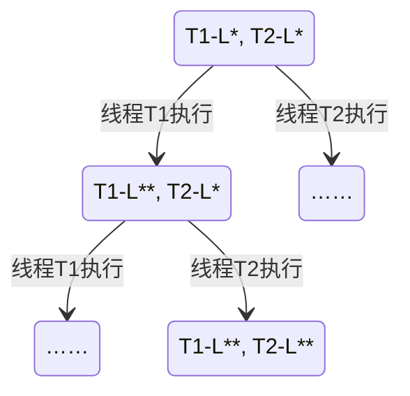

互斥 (mutual exclusion)：保证两个线程不能同时 (并发) 执行一段代码。

对于 `sum.c` ，我们希望添加两个魔法函数 lock() 和 unlock()，使得魔法函数中间的代码具有互斥性：

```diff
void Tsum()
{
	for (int i = 0; i < N; i++)
	{
+		lock();
		sum++;
+		unlock();
	}
}
```

一个失败的尝试：

```c
#define LOCK   1
#define UNLOCK 0
void critical_section()
{
retry:
    if (locked != UNLOCK)   //*
        goto entry;
    locked = LOCK;          //**
    
    // critical section
    
    locked = UNLOCK;
}
```

从状态机的角度：



可以看到存在一个状态，T1 和 T2 同时获得了锁。该方法失败的根本原因是：我们读锁状态的操作和写锁状态的操作无法原子地执行。

## Peterson Algorithm

理解并发的最好方法就是用物理世界中的东西作类比：

* 对共享内存的写：往黑板上贴便签条
* 对共享内存的读：看黑板 (其实不同于人类，计算机的“读”只能看到一个“历史状态”)

---

假设 Alice 和 Bob 想上厕所，为了不一起进入厕所，他们制定了如下协议：

* Alice 想上厕所，于是举起了自己的旗子 (step1，相当于 STORE 一个共享的变量)，然后将 Bob (对方) 的名字写在厕所门上 (step2，也相当于 STORE 一个共享变量)；如果 Bob 想上厕所也是同理。注意厕所门上的名字是可以覆盖的。
* Alice 检查门上的名字和厕所 (step3)，Alice 可以进入厕所当且仅当 Bob 没有举旗子，或者门上的名字是自己的。
* Alice 上完厕所后，把自己的旗子放下来 (step4)。

我们讨论几种情况：

* Alice 检查的时候，如果 Bob 没举旗子，说明 Bob 还不想上厕所，那 Alice 可以上厕所。
* 如果 Bob 也举旗子了，那结果是：先举旗子的人可以先进入厕所，因为后举旗子的人会把先举旗子的人的名字贴在门上，覆盖了先贴的人的内容。
* ……

一个完备的证明方法是画状态机。我们设置状态机 $(PC_1, PC_2, x, y, turn,status)$，六个状态分别表示 T1/T2 执行到第几行，T1/T2 的旗子有没有举起来，当前厕所门上写的是谁的名字，以及当前厕所状态。


我们还可以写一个小程序验证 Peterson：

```c
#define BARRIER __sync_synchronize()	
void critical_section() {
  long cnt = atomic_fetch_add(&count, 1);
  int i = atomic_fetch_add(&nested, 1) + 1;
  if (i != 1) {
    printf("%d threads in the critical section @ count=%ld\n", i, cnt);
    assert(0);
  }
  atomic_fetch_add(&nested, -1);
}

int volatile x = 0, y = 0, turn;

void TA() {
  while (1) {
    x = 1;                   BARRIER;
    turn = B;                BARRIER; // <- this is critcal for x86
    while (1) {
      if (!y) break;         BARRIER;
      if (turn != B) break;  BARRIER;
    }
    critical_section();
    x = 0;                   BARRIER;
  }
}

void TB() {
  while (1) {
    y = 1;                   BARRIER;
    turn = A;                BARRIER;
    while (1) {
      if (!x) break;         BARRIER;
      if (turn != A) break;  BARRIER;
    }
    critical_section();
    y = 0;                   BARRIER;
  }
}
```

在 critical_section() 中，代码主要做的事情是操作一个共享变量，如果某个时刻 `nested == 2`，说明两个线程同时进入了临界区域，则报错。

由于现代编译器和多处理器会调整语句顺序/乱序执行……所以我们在每条语句后面添加一条 `__sync_synchronize()` 来保证编译按照顺序进行，且多处理器之间具有可见性。事实证明，如果去掉 BARRIER 会发生错误。

## Model Checker

我们希望用程序自动画出状态机。[model-checker.py](https://kristoff-starling.github.io/files/model-checker.py) 帮助我们完成了这项工作，其中用到的 python 语言机制较多，暂时留坑。我们可以用 `model-checker.py` 中编写的装饰器来编写多个线程，[peterson-flag.py](https://kristoff-starling.github.io/files/peterson-flag.py) 是一个示例。使用命令 `python3 model-checker.py xxx.py` 可以输出状态机的所有节点和转移关系。

`model-checker.py` 主要利用了 python generator 的机制来快速获得进程的状态机。

```python
def numbers(init=0, step=1):
    n = init
    while True:
        n += step
        yield n

g = numbers()
h = numbers(100, 200)
print(g, h)

print(g.__next__())
print(g.__next__())
print(h.__next__())
print(g.__next__())
print(h.__next__())
```

该程序输出结果为

```
<generator object numbers at 0x7f0a75b4fcf0> <generator object numbers at 0x7f0a759f9ba0>
1
2
300
3
500
```

虽然 numbers() 里面是一个死循环，但执行 numbers() 还是可以退出，这得益于 `yield` 语句，yield 的功能类似于操作系统的调度，它会主动让出执行流。`g.__next__()` 语句可以从被打断处重新进入，继续执行函数直到遇到下一次 yield。如果我们在每一条语句后面都加上一个 yield，让 yield 后面返回所有的线程局部变量，我们就获得了函数每执行一步之后的状态机。

Model checker 将验证程序正确性的问题转化成了一个图论问题：

* Safety (线程是否互斥)：从初始状态出发，是否存在到红色 (互斥失败) 节点的路径？

    > 图搜索

* Liveness：是否从任意黑色 (没有人执行临界区域代码) 状态出发，总能在有限步内到达蓝色/绿色 (有一个线程执行临界区域代码) 节点？

    > 这等价于只考虑图中的黑色节点，是否存在环。只要对黑色节点的导出子图求 SCC 即可。