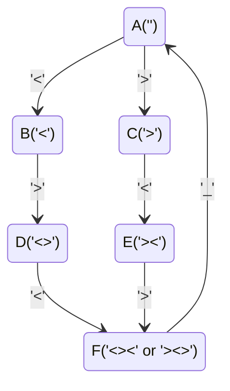

线程同步：在某个时间点共同达到互相已知的状态。(每个线程都有可能做自己的某个耗时很长的工作)

* nnpy：等我洗完头就吃饭/等我打完游戏就吃饭。
* “先到先等”的同步机制。

<!-- more -->

## Producer-Consumer Problem

```c
void Tproducer() {while (1) puts("(");}
void Tconsmuer() {while (1) puts(")");}
```

我们希望生成合法的括号序列，且括号序列嵌套深度不超过给定值 $n$：

* producer: 序列深度小于 $n$ 才能打印；
* consumer: 序列深度大于等于 1 才能打印。

我们可以用一个队列来维护任务池，producer 将任务放到队尾，consumer 从队头取任务。取和放的操作都要在锁的保护下进行。

```c
// pc.c
#include "thread.h"
#include "thread-sync.h"

int n, count = 0;
mutex_t lk = MUTEX_INIT();

void Tproduce() {
  while (1) {
retry:
    mutex_lock(&lk);
    if (count == n) {
      mutex_unlock(&lk);
      goto retry;
    }
    count++;
    printf("(");
    mutex_unlock(&lk);
  }
}

void Tconsume() {
  while (1) {
retry:
    mutex_lock(&lk);
    if (count == 0) {
      mutex_unlock(&lk);
      goto retry;
    }
    count--;
    printf(")");
    mutex_unlock(&lk);
  }
}

int main(int argc, char *argv[]) {
  assert(argc == 2);
  n = atoi(argv[1]);
  setbuf(stdout, NULL);
  for (int i = 0; i < 8; i++) {
    create(Tproduce);
    create(Tconsume);
  }
}
```

> **Tip: 如何证明这个模型是正确的？**
>
> 我们可以编写一个压力测试：
>
> ```python
> import sys
> 
> limit = int(sys.argv[1])
> count, n = 0, 100000
> while True:
> for ch in sys.stdin.read(n):
>   if ch == '(': count += 1
>   if ch == ')': count -= 1
>   assert 0 <= count <= limit
> print(f'{n} Ok.')
> 
> ```
>
> 指定较深层次的括号，每检查 100000 个括号输出一个 OK 信息。
>
> 我们还可以用 model checker 证明该模型的正确性：
>
> ```python
> # pc.py
> class ProducerConsumer:
>   locked, count, log, = '', 0, ''
> 
>   def tryacquire(self):
>       self.locked, seen = '🔒', self.locked
>       return seen == ''
> 
>   def release(self):
>     self.locked = ''
> 
>   @thread
>   def tp(self):
>       while True:
>          while not self.tryacquire(): pass
>          if not self.count == 1:
>            break
>          self.release()
>       self.log, self.count = self.log + '(', self.count + 1
>       self.release()
> 
>   @thread
>   def tc1(self):
>       while True:
>          while not self.tryacquire(): pass
>          if not self.count == 0:
>            break
>          self.release()
>       self.log, self.count = self.log + ')', self.count - 1
>       self.release()
> 
>   @thread
>   def tc2(self):
>       while True:
>          while not self.tryacquire(): pass
>          if not self.count == 0:
>            break
>          self.release()
>       self.log, self.count = self.log + ')', self.count - 1
>       self.release()
> 
>   @marker
>   def mark_negative(self, state):
>       count = 0
>       for ch in self.log:
>          if ch == '(': count += 1
>          if ch == ')': count -= 1
>          if count < 0: return 'red'
> ```
>
> 使用命令 `python model-checker.py pc.py | grep red` 可以快速检查是否有红色节点。

## Conditional Variable

轮询地等待条件成立太浪费事件了。我们希望在条件不满足的时候进入睡眠状态，然后条件可能满足的时候把我唤醒，于是有了条件变量 (注：这个思想和睡眠锁类似，但等待的对象不一样。睡眠锁等待的是空锁的出现，而条件变量是在获得锁之后，等待关键变量相关的条件可能成立的时机)。

条件变量最基本的 API 有：

```c
int pthread_cond_wait(pthread_cond_t *cv, pthread_mutex_t *lk);
int pthread_cond_signal(pthread_cond_t &cv);
int pthread_cond_broadcast(ptread_cond_t &cv);
```

* wait() 函数传入一个条件变量和一个互斥锁，调用时要求线程持有该锁。wait() 会将这个互斥锁释放掉，然后睡眠该线程。等到有别的线程调用 signal() 或 broadcast() 来唤醒这个条件变量有关的线程时，wait() 会重新获得互斥锁，并继续执行下去。
* signal() 和 broadcast() 的作用都是唤醒在条件变量 cv 上睡眠的线程。两者的不同是 signal() 只挑一个线程唤醒，broadcast() 会唤醒所有 cv 上的线程。

条件变量的正确使用方式如下：

```c
mutex_lock(&lk);
while (!cond) {
    cond_wait(&cv, &lk);
}
assert(cond);

// do some job.
// if job is unrelated to critical variables, mutex lock can be released.

/* if other threads' cv may be satisfied */
cond_broadcast(&cv);
/* ------------------------------------- */
mutex_unlock(&lk);
```

有几点需要说明：

* `while (!cond)` 写成 `if (!cond)` 是一个常见的错误。比如当前有一个 Tproducer 和两个 Tconsumer，那么可能出现 Tproducer 打印完 `(`  后唤醒了第一个 Tconsumer，然后第一个 Tconsumer 打印完 `)` (此时已经不能再打印 `)` ) 后唤醒了第二个 Tconsumer。如果是 `if (!cond)` ，第二个 Tconsumer 被唤醒了之后无法再进行条件检查，从而又打出一个 `)` 导致错误。

    使用 `while (!cond)` 保证了跳出 while 循环后 cond 一定是成立的。

* 使用 `cond_broadcast(&cv)` 而不是 `cond_signal(&cv)` 可以避免一些“死锁”情况，例如在没有多余的任务时，若干个 consumer 互相 signal 导致任务无法进行下去。

> **Tproducer 完成任务后从唤醒一个睡在 comsumer-cv 上的线程，Tconsumer 完成任务后唤醒一个睡在 producer-cv 上的线程。为什么这个模型不对？**
>
> ```python
> class ProducerConsumer:
>     locked, count, log, waitp, waitc = '', 0, '', '', ''
> 
>     def tryacquire(self):
>         self.locked, seen = '🔒', self.locked
>         return seen == ''
> 
>     def release(self):
>         self.locked = ''
> 
>     @thread
>     def tp(self):
>         for _ in range(2):
>             while not self.tryacquire(): pass # mutex_lock()
> 
>             if self.count == 1:
>                 # cond_wait
>                 _, self.waitp = self.release(), self.waitp + '1'
>                 while '1' in self.waitp: pass
>                 while not self.tryacquire(): pass
> 
>             self.log, self.count = self.log + '(', self.count + 1
>             self.waitc = self.waitc[1:] # cond_signal
>             self.release() # mutex_unlock()
> 
>     @thread
>     def tc1(self):
>         while not self.tryacquire(): pass
> 
>         if self.count == 0:
>             _, self.waitc = self.release(), self.waitc + '2'
>             while '2' in self.waitc: pass
>             while not self.tryacquire(): pass
> 
>         self.log, self.count = self.log + ')', self.count - 1
> 
>         self.waitp = self.waitp[1:]
>         self.release()
> 
>     @thread
>     def tc2(self):
>         while not self.tryacquire(): pass
> 
>         if self.count == 0:
>             _, self.waitc = self.release(), self.waitc + '3'
>             while '3' in self.waitc: pass
>             while not self.tryacquire(): pass
> 
>         self.log, self.count = self.log + ')', self.count - 1
> 
>         self.waitp = self.waitp[1:]
>         self.release()
> ```
>
> 使用 model checker 对该算法进行分析。下面的这种情形会导致问题：
>
> * Tc2 首先运行，获得锁之后发现 `count == 0` ，于是释放锁并睡眠在 consumer-cv 上。
> * Tp 运行，获得锁之后打印左括号，`count += 1` ，唤醒了线程 Tc2，然后释放了锁。
> * Tc2 被唤醒了以后并没有获得锁，而是 Tc1 抢先获得了锁，打印了右括号，`count -= 1`，然后释放了锁。
> * Tc2 获得了锁。但此时 Tp 生产的资源已经被 Tc1 用掉了，Tc2 因为没有使用 while 判断 count，所以直接打印了右括号，`count -= 1`，错误发生。

只要是可以多线程的工作，都可以使用上面的模板来进行并行加速。通常来说，如果一个任务要分成若干个“层“，每”层“内的任务之间互相独立，我们就可以利用多线程加速每一层的运算 (但层与层之间的依赖关系是无法多线程加速的)。

### Example: fish

>  使用打印 `<` `>` 和 `_` 的三个线程连续输出小鱼。鱼的形态有两种：`<><_` 和 `><>_`。

使用万能的条件变量。我们要搞清楚的事情是：这三个线程应该在什么条件下可以输出？我们画出状态机：



我们只要在程序中维护当前到达的状态机顶点，然后根据状态机的出边决定某个线程是否可以打印即可。还需要注意的一点是：打印 `<` `>` `_` 的线程可能各有很多个。从状态机当前节点出发，只能有一个可行字符线程打印。因此还需要一个变量控制当前是否已经有线程在打印途中。

```c
// fish.c
#include "thread.h"
#include <string.h>

#define LENGTH(arr) (sizeof(arr) / sizeof(arr[0]))

enum { A = 1, B, C, D, E, F, };

struct rule {
  int from, ch, to;
};

struct rule rules[] = {
  { A, '<', B },
  { B, '>', C },
  { C, '<', D },
  { A, '>', E },
  { E, '<', F },
  { F, '>', D },
  { D, '_', A },
};
int current = A, quota = 1;

pthread_mutex_t lk   = PTHREAD_MUTEX_INITIALIZER;
pthread_cond_t  cond = PTHREAD_COND_INITIALIZER;

int next(char ch) {
  for (int i = 0; i < LENGTH(rules); i++) {
    struct rule *rule = &rules[i];
    if (rule->from == current && rule->ch == ch) {
      return rule->to;
    }
  }
  return 0;
}

void fish_before(char ch) {
  pthread_mutex_lock(&lk);
  while (!(next(ch) && quota)) {
    // can proceed only if (next(ch) && quota)
    pthread_cond_wait(&cond, &lk);
  }
  quota--;
  pthread_mutex_unlock(&lk);
}

void fish_after(char ch) {
  pthread_mutex_lock(&lk);
  quota++;
  current = next(ch);
  assert(current);
  pthread_cond_broadcast(&cond);
  pthread_mutex_unlock(&lk);
}

const char roles[] = ".<<<<<>>>>___";

void fish_thread(int id) {
  char role = roles[id];
  while (1) {
    fish_before(role);
    putchar(role); // can be long; no lock protection
    fish_after(role);
  }
}

int main() {
  setbuf(stdout, NULL);
  for (int i = 0; i < strlen(roles); i++)
    create(fish_thread);
}
```

这个 `fish.c` 写的非常漂亮。它完全复刻了状态机的思想，维护了可行的转移条件。变量 quota 保证了只有一个线程“出手”打印。

还值得注意的一点是，`putchar(role)` 这个操作和控制状态机转移的关键变量 current 和 quota 无关。且 I/O 操作理论上速度较慢。这样的工作是可以放在锁外面进行的 (事实上，由于 quota 的控制，这个操作并没有起到明显的优化效果)。

我们可以对其进行压力测试：

```python
# fish-check.py
import sys

n, count = 100000, 0
while True:
    animal = str(sys.stdin.read(4))
    assert animal == '<><_' or animal == '><>_'
    count += 1
    if count == n:
        print(f'{n} OK.')
        count = 0
```

## Semaphore

在上述的括号打印问题中，我们使用互斥锁来保护我们对 count 变量的更新操作。一个想法是：可不可以不止一个锁，而是有 $n$ 个手环。手环数量不能超过上限，producer 可以生产手环，consumer 必须领到手环才能做事情？这种维护了“一堆手环”的锁就是信号量。

下面的 python 代码描述了信号量的行为建模：

```python
# sem.py
class Semaphore:
    token, waits = 1, ''

    def P(self, tid):
        if self.token > 0:
            self.token -= 1
            return True
        else:
            self.waits = self.waits + tid
            return False

    def V(self):
        if self.waits:
            self.waits = self.waits[1:]
        else:
            self.token += 1

    @thread
    def t1(self):
        self.P('1')
        while '1' in self.waits: pass
        cs = True
        del cs
        self.V()

    @thread
    def t2(self):
        self.P('2')
        while '2' in self.waits: pass
        cs = True
        del cs
        self.V()
```

变量 token 维护了资源 (手环) 的数量。P() 用于获取手环，如果当前有剩余的手环就领走，并进入临界区域；如果当前没有剩余的手环就进入等待序列。V() 用于归还手环。如果当前有正在等待的人，就直接将手环交给它 (wait list 队首元素弹出)，如果没有就归还给 kernel (token++)。

C 语言的线程库为我们提供了信号量的相关 API:

```c
int sem_init(sem_t *sem, int pshared, unsigned int value);
int sem_wait(sem_t *sem);
int sem_post(sem_t *sem);
```

* sem_init() 用于初始化一个信号量，`pshared == 0` 表示该信号量只在当前进程的线程之间共享；`pshared == 1` 表示该信号量可以跨进程共享。value 表示信号量的初始值 (游泳馆的最大手环个数)。
* sem_wait() 和 sem_post() 等价于之前的 P() 和 V()，用于领取手环和归还手环。

利用这些 API 我们可以非常轻巧地实现之前的括号打印任务：

```c
// pc-sem.c
#include "thread.h"
#include "thread-sync.h"

sem_t fill, empty;

void producer() {
  while (1) {
    P(&empty);
    printf("(");
    V(&fill);
  }
}

void consumer() {
  while (1) {
    P(&fill);
    printf(")");
    V(&empty);
  }
}

int main(int argc, char *argv[]) {
  assert(argc == 2);
  SEM_INIT(&fill, 0);
  SEM_INIT(&empty, atoi(argv[1]));
  for (int i = 0; i < 8; i++) {
    create(producer);
    create(consumer);
  }
}
```

通常来说，信号量在”一单位资源“明确的情况下比较好用 (比如这里的“一单位资源”就是指一个尚未匹配的左括号)，在有些场景下使用信号量很难写出正确的并发程序。此外，信号量的 V() 函数是可以在“没有领取手环”的时候“凭空”“变出一个手环“上交的，因此使用时必须格外小心。

## Dining Philosophers Problem

> 五个哲学家围成一桌吃饭。每两个人之间有一把叉子 (一共五把)，哲学家只有同时拿到左边和右边的叉子才能吃饭。如何维护这件事情？

这件事情不是很好明确“一单位资源“：一把叉子既是某位哲学家的“右叉子”，又是某位哲学家的“左叉子”，如果我们对每把叉子维护一个信号量，写入如下程序：

```c
// philosopher.c
#include "thread.h"
#include "thread-sync.h"

#define N 5
sem_t locks[N];

void Tphilosopher(int id) {
  int lhs = (N + id - 1) % N;
  int rhs = id % N;
  while (1) {
    P(&locks[lhs]);
    printf("T%d Got %d\n", id, lhs + 1);
    P(&locks[rhs]);
    printf("T%d Got %d\n", id, rhs + 1);
    V(&locks[lhs]);
    V(&locks[rhs]);
  }
}

int main(int argc, char *argv[]) {
  for (int i = 0; i < N; i++) {
      SEM_INIT(&locks[i], 1);
  }
  for (int i = 0; i < N; i++) {
    create(Tphilosopher);
  }
}
```

运行一小会儿就会卡住。此时每个哲学家都抓着自己左手边的叉子，它们都想得到右叉子，但都得不到。因为都得不到，他们也不会放下自己手中的叉子。这就是死锁。如果把每把叉子想象成图中的节点，哲学家们对叉子的需求序列 (先要左叉子，再要右叉子) 就构成了一个环。如果锁依赖关系中有环，就可能出现死锁。

当然我们可以用万能的条件变量来正确实现：

```c
mutex_lock(&mutex);
while (!(avail[lhs] && avail[rhs])) {
  wait(&cv, &mutex);
}
avail[lhs] = avail[rhs] = false;
mutex_unlock(&mutex);

mutex_lock(&mutex);
avail[lhs] = avail[rhs] = true;
broadcast(&cv);
mutex_unlock(&mutex);
```

该段代码与之前相比的区别在于，哲学家总是看到左右叉子都有再同时拿起，吃完了就会放下。不会出现之前方法中的哲学家拿到一把叉子再等另一把叉子，自己手里的叉子也不给别人用的情况。

系统中另一种常见的处理生产者-消费者模型的方法是 master-slave：我们安排一个服务员来维护所有的叉子，所有的哲学家都通过与服务员通信的方法来向服务员索要叉子/让服务员把叉子取走。

```c
void Tphilosopher(int id) {
  send_request(id, EAT);
  P(allowed[id]); // waiter 会把叉子递给哲学家
  philosopher_eat();
  send_request(id, DONE);
}

void Twaiter() {
  while (1) {
    (id, status) = receive_request();
    if (status == EAT) { ... }
    if (status == DONE) { ... }
  }
}
```
