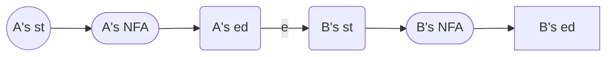

Summary of (extended) regular expression rules:

* At least one: $A^{+}\triangleq AA^*$
* Union: $A | B \triangleq A + B$
* Option: $A?\triangleq A+\epsilon$
* Range: $[a- z]\triangleq a+b+\cdots+z$
* Excluded range: $[$^$a- z]\triangleq$ complement of $[a- z]$

## Lexical Specification

The procedure of lexical analysis:

1. Write a rexp for the lexemes of each token class, i.e., number, identifier, keywords etc.

2. Construct $R$, matching all lexemes i.e. $R = R_1 + R_2 + \cdots$.

3. Let input be $x_1x_2\cdots x_n$, for each $1\leq i\leq n$, check whether $x_1\cdots x_i\in L(R)$.

    > **Which prefix to choose?**
    >
    > Sometimes we may have $x_1\cdots x_i\in L(R)$, $x_1\cdots x_j\in L(R)$ and $i\neq j$ (e.g. `==` and `=`). In this situation we follow the "**maximal munch**" principle, i.e., we always choose the longer one.

    > **What if no rule matches?**
    >
    > Compilers should do error handling instead of crashing when there is an lexical error. A common way to handle this is to define an extra set $\text{Error}\triangleq \text{all strings}$ and give it the lowest priority.

4. If success, then we know that $x_1\cdots x_i\in L(R_j)$ for some $j$.

    > **Which token to choose?**
    >
    > Sometimes we may have $x_1\cdots x_i\in L(R_j)$, $x_1\cdots x_i\in L(R_k)$ and $j\neq k$. (e.g. `if` is a keyword, but it also satisfies the definition of identifiers). In this situation we choose the one with higher priority.
    >
    > (Actually, usually in the definition of identifiers keywords are explicitly excluded.)

5. Remove $x_1\cdots x_i$ from input and go to (3).

## Finite Automata

A regular expression $R$ formally defines a set of strings $L(R)$. However, we need an implementation to identify that given a string $s$, whether $s\in L(R)$. Finite automata is a good implementation model.

A finite automaton consists of

* An input alphabet $\Sigma$
* A finite set of states $S$
* A start state $n$
* A set of accepting states $F\subseteq S$
* A set of transitions $\text{state1}\overset{input}{\to}\text{state2}$

Given an input string, If we reach the end of input and we're an accepting state, the automaton **accept** the string. The automaton **reject** a string if 1) we're not in an accepting state. 2) we get stuck (no transition).

The language of a finite automaton is the set of accepted strings.

Example: a finite automaton accepting strings with any number of 1 and a 0 at the end.


There's a special transition called $\epsilon$ transition: $A\overset{\epsilon}{\to}B$. This transition doesn't consume any character, i.e., we can choose to go to $B$ from $A$ with no condition.

There are 2 kinds of FA:

* **Deterministic Finite Automata (DFA)**:

    * One transition per input label per state
    * No $\epsilon$-moves

* **Nondeterministic Finite Automata (NFA)**:

    * Can have multiple transitions for one input label in a given state
    * Can have $\epsilon$-moves

    Actually, the first condition is not essential because we can use $\epsilon$-moves to transform it into a normal one. Here's an example:

    ```mermaid
    graph LR
    s1(1) --> |1|s2(2)
    s1 --> |1|s3(3)
    
    s4(1) --> |e|s5(N/A)
    s4 --> |e|s6(N/A)
    s5 --> |1|s7(2)
    s6 --> |1|s8(3)
    ```

A crucial difference between DFA and NFA is that given an input, after receiving several characters, we're in a certain state in DFA while we may be in a set of possible states in NFA. An NFA accepts a string if there exists a path that reaches an accepting state.

NFA, DFA and regular expressions have the equivalent power of representing languages. Usually DFA are faster to execute (there's no choice to consider), but NFA is much smaller (exponentially smaller).

## Regular Expressions to NFAs

Target: lexical specification $\to$ regular expressions $\to$ NFA $\to$ DFA $\to$ table-driven implementation of DFA

The way we transform regular expressions to NFAs is to design an NFA for each RE rule.

We denote the NFA for expression A as


$\epsilon$:


A character $a$:


Rule $AB$:



Rule $A + B$:


Rule $A^*$:


An example: $(1+0)^*1$:


## NFA to DFA

An NFA may be in many states at any time. However, for a n-state NFA, there are at most $2^N-1$ different subsets of states, which is finite. That's the core idea of how to transform NFA to DFA.

$\fbox{Definition}$ ($\epsilon$-closure) The $\epsilon$-closure of a node $q$ in NFA, denoted as $\epsilon\text{-closure}(q)$, is the set of nodes that can be reached from $q$ by walking through only $\epsilon$ edges. For example, in the NFA above, $\epsilon\text{-closure}(q_6)=\{q_0,q_1,q_2,q_4,q_7,q_8\}$.

$\fbox{Definition}$ For a set of states $X$ and a character $a$ in NFA, $a(X)\triangleq \{y|\exists x\in X, x\overset{a}{\to}y\}$.

Components of an NFA:

* states: a set $S$.
* start: a state $s\in S$.
* final: a set $F\subseteq S$.

Corresponding DFA:

* states: nonempty subsets of $S$.
* start: $\epsilon\text{-closure}(s)$.
* final: $\{X\subseteq S|X\cap F\neq \emptyset\}$.
* transitions: $X\overset{a}{\to}Y$ exists iff $Y=\epsilon\text{-closure}(a(X))$.

An example: $(1+0)^*1$:


## Implementing Finite Automata

A DFA can be represented as a 2D table. States and input symbols are the two dimensions and the contents of the table are transition. Pseudocode can be written based on this:

```c++
i = 0;
state = initial;
while (input[i] != '\0') {    
    state = table[state][input[i]];    
    i++;
}
```

If the table is too huge, we can directly use NFA: the table should add a column representing $\epsilon$ transitions and all the contents are set of states instead of states.

Although NFA's table is more concise, the simulation is more expensive because we have to maintain a set of current states.