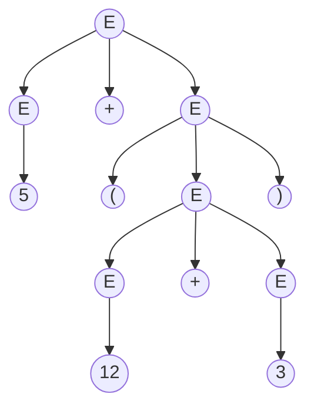
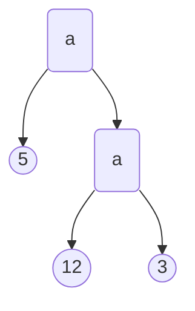

## Error Handling

Purpose of the compiler:

* <u>to detect non-valid programs</u>
* to translate the valid ones.

The error handler should

* Report errors accurately and clearly
* Recover from an error quickly
* Not slow down compilation too much.

### Panic Mode

When an error is detected, the parser discards tokens until one with a clear role is found and continues from there. The tokens "with a clear role" are referred to as **syncrhonizing tokens** and typically are the statement or expression terminators.

For example, the expression `(1++2)+3` is invalid. When the parser sees the second `+`, it knows that it's invalid to have 2 consecutive `+` and enters panic mode. In panic mode, a possible recovery strategy is to skip ahead to next integer and then continue, i.e., continue at `2`.

In Bison, we can use the special terminal `error` to describe how much input to skip. For example, if we write
$$
E\to \text{int}\space |\space E+E\space |\space (E)\space |\space \text{error int}\space |\space (\text{error})
$$
when the parser enters panic mode, `error` will match any number of characters and the rule `error int` will let the parser continue at the next integer.

### Error Productions

Another way to handle errors is to specify known common mistakes into the grammar. For example, it's common for programmers to forget `*` (i.e. `5x` instead of `5 * x`), so we can write
$$
E\to\space ...\space |\space E\space E
$$
The `E E` is responsible for matching errors.

The disadvantages of error productions is that it significantly slows down the compilation.

### Error Correction

Some compilers support error correction. When it encounters an error, it will find a correct "nearby" program through exhaustive search or token insertions/deletions.

The disadvantages of error correction:

* hard to implement.
* slows down parsing of correct programs.
* "nearby" is not necessarily "the intended" program.

## Abstract Syntax Trees

For an expression `5+(12+3)`, we have a parse tree:



However, the parse tree contains too much unnecessary information: parentheses, single-successor nodes etc. Therefore in compilers we use the abstract syntax tree (abbr: AST) instead.



## Recursive Descent Parsing

In this algorithm, the parse tree is constructed from the top and from left to right. The general procedure is: we continuously check the left-most unchecked node:

* If it's an unterminal, we try the productions in order and recursively do the parsing.
* If it's an terminal, we compare the node with the current character in the input string (backtracking is needed if they fail to match).

### Recursive Descent Algorithm

Let TOKEN be the type of tokens. Let the global `next` pointer to the next input token.

Some needed boolean functions:

```c++
bool term(TOKEN tok)  // whether a given token terminal matches the input
bool Sn();            // whether the n-th production of S works
bool S();             // whether there exists any production of S that works
```

An example: productions for arithmetic expressions with `+` `*` and parentheses:
$$
\begin{align}
E&\to T\space |\space T+E\\\\
T&\to \text{int}\space |\space \text{int}\space *\space T\space |\space (E)
\end{align}
$$
Our code should be

```c++
bool term(TOKEN tok) { return *next++ = tok; }

bool E1() { return T(); }
bool E2() { return T() && term(PLUS) && E(); }
bool T1() { return term(INT); }
bool T2() { return term(INT) && term(TIMES) && T(); }
bool T3() { return term(OPEN) && E() && term(CLOSE); }

bool E() {
    TOKEN *save = next;
    return (next = save, E1()) || (next = save, E2());
}

bool T() {
    TOKEN *save = next;
    return (next = sava, T1()) || (next = save, T2()) || (next = save, T3());
}
```

To start the parser, set `next` to the first character of the input string and call `E()`.

## Left Recursion

Consider the following grammar: $S\to S\alpha\space |\space \beta$, which accepts strings with $\beta$ at the beginning and arbitrary $\alpha$  after. If we write the code:

```c++
bool S1() { return S() && term(ALPHA); }
bool S2() { return term(BETA); }
bool S() {
    TOKEN *save = next;
    return (next = save, S1()) || (next = save, S2());
}
```

The program will result in infinite loop (`S()` calls `S1()`, `S1()` calls `S()` and so on). The problem is that the grammar is left recursive - the derivation generate strings from right to left, but our parser scans from left to right. We need to rewrite the grammars as right recursive:
$$
\begin{align}
S&\to \beta S'\\\\
S'&\to \alpha S'\space |\space \epsilon
\end{align}
$$
In principle, grammars can be transformed to right recursive ones automatically. But in practice people manually do the transformation.