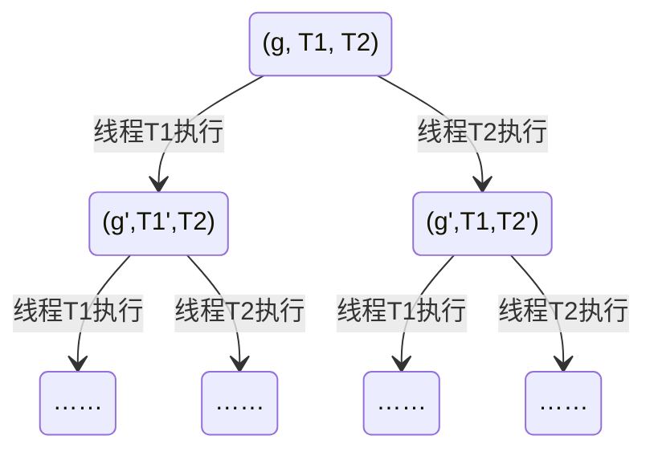

并发：一个计算机程序被分成了若干个部分，在不改变程序最终运行结果的情况下，这些部分被乱序地执行。并发执行的多个部分会共享资源。

<!-- more -->

## State Machine

在单线程视角中，C 程序的状态机包括全局变量，堆区，栈帧列表等。全局变量和堆区的内容是全局的，是所有函数共享的，理应作为共享资源；栈帧中的变量都是局部变量，栈帧与栈帧之间独立性较强，可以交给多个线程。

多线程视角下的状态机：

* 全局变量，堆区等全局共享资源；
* 若干个栈帧链，每条栈帧链属于一个线程。

在并发程序中，每一步的结果都是 non-deterministic 的，它的状态转移图是长成这样的：



## Simplified Thread API

```c
// thread.h
#include <stdlib.h>
#include <stdio.h>
#include <stdatomic.h>
#include <assert.h>
#include <unistd.h>
#include <pthread.h>

#define NTHREAD 6400
enum { T_FREE = 0, T_LIVE, T_DEAD, };
struct thread {
  int id, status;
  pthread_t thread;
  void (*entry)(int);
};

struct thread tpool[NTHREAD], *tptr = tpool;

void *wrapper(void *arg) {
  struct thread *thread = (struct thread *)arg;
  thread->entry(thread->id);
  return NULL;
}

void create(void *fn) {
  assert(tptr - tpool < NTHREAD);
  *tptr = (struct thread) {
    .id = tptr - tpool + 1,
    .status = T_LIVE,
    .entry = fn,
  };
  pthread_create(&(tptr->thread), NULL, wrapper, tptr);
  ++tptr;
}

void join() {
  for (int i = 0; i < NTHREAD; i++) {
    struct thread *t = &tpool[i];
    if (t->status == T_LIVE) {
      pthread_join(t->thread, NULL);
      t->status = T_DEAD;
    }
  }
}

__attribute__((destructor)) void cleanup() {
  join();
}
```

`thread.h` 是对 C 库 pthreads 的进一步封装。其中的一些关键函数和代码解读如下：

* `create(fn)` ：创建一个新的线程并立即执行，该线程的入口函数是 fn。

    * 函数 fn 的定义为 `void fn(int tid)`，其中 tid 为线程号，从 1 开始编号。

    * 从状态机的角度来看，create() 的语义是在状态机中新开了一个链表，这个链表只有一个 fn 函数的栈帧。

    * 原理：pthread_create() 函数的声明为

        ```c
        int pthread_create(pthread_t *thread, const pthread_attr_t *attr, void *(*start_routine)(void *), void *arg);
        ```

        其中 start_routine 是新线程第一个执行的函数，arg 是给 start_routine 传入的参数，attr 设置为 NULL 表示按照默认方式创建线程。`thread.h` 中传入的 start_routine 是 wrapper，wrapper 中的语句 `thread->entry(thread->id)` 以线程号为参数，调用了 fn 函数。

* `join()`：`join()` 是线程中的“等待”，和进程中的 wait() 有一点相似。`join()` 的语义相当于在调用该函数的线程中加入了一条死循环语句：

    ```c
    while (其他线程未结束);
    ```

    * 假设当前有三个线程 T1,T2,T3，T1 中调用了 `join()`，则之后的状态机如下：

        ```mermaid
        stateDiagram-v2
            state1:(T1(join),T2,T3)
            state1 --> state1: 线程 T1 执行
            state1 --> state2: 线程 T2 执行
            state1 --> state3: 线程 T3 执行
            state2:(T1(join), T2(end), T3)
            state3:(T1(join), T2, T3(end))
            state2 --> state2: 线程 T1 执行
            state2 --> state4: 线程 T3 执行
            state3 --> state3: 线程 T1 执行
            state3 --> state4: 线程 T2 执行
            state4: (T1,T2(end),T3(end))
            note right of state4
                T2,T3 线程均结束，T1 死循环解除
            end note
            state4 --> state5
            state5: ……
        ```

    * 原理：join() 中主线程会遍历线程数组，调用 pthread_join() 函数等待它们一一结束，将其状态设置为 T_DEAD，然后返回。pthread_join() 函数的声明为：

        ```c
        int pthread_join(pthread_t thread, void **retval);
        ```

        当前函数会等待 thread 线程执行结束 (若 thread 已经结束就直接返回)，如果 retval 指针不为空，就将 thread 线程的退出状态指针填写到 retval 中。

* 在 include 了 `threads.h` 的情况下，main() 函数执行结束后，所有新创建的线程会被自动释放。该功能是由 `thread.h` 中的 clean_up() 函数实现的 (添加了 `__attribute__((destructor))` 的函数会在 main() 函数返回之后被执行)。clean_up() 额外调用了一次 join()，

## Concurrent Programming: Introduction

全局的变量会被各个线程共享，我们可以写一个程序来证明这一点：

```c
// shm-test.c
#include "thread.h"

int x;

void Thello(int tid)
{
	usleep(tid * 100000);
	printf("Hello world from thread #%c\n", "0123456789ABCDEF"[x++]);
}

int main ()
{
	x = 1;
	for (int i = 0; i < 10 ; i++)
		create(Thello);
	return 0;
}
```

该程序的输出结果为

```
Hello world from thread #1
Hello world from thread #2
Hello world from thread #3
Hello world from thread #4
Hello world from thread #5
Hello world from thread #6
Hello world from thread #7
Hello world from thread #8
Hello world from thread #9
Hello world from thread #A
```

可以看到，某一个线程对全局变量 x 的修改在别的线程是可见的。

---

我们可以写一个小程序来探测每个线程的栈空间大小：

```c
// stack-probe.c
#include "thread.h"

__thread char *base, *cur; // thread-local variables
__thread int id;

// objdump to see how thread-local variables are implemented
__attribute__((noinline)) void set_cur(void *ptr) { cur = ptr; }
__attribute__((noinline)) char *get_cur()         { return cur; }

void stackoverflow(int n) {
  set_cur(&n);
  if (n % 1024 == 0) {
    int sz = base - get_cur();
    printf("Stack size of T%d >= %d KB\n", id, sz / 1024);
  }
  stackoverflow(n + 1);
}

void Tprobe(int tid) {
  id = tid;
  base = (void *)&tid;
  stackoverflow(0);
}

int main() {
  setbuf(stdout, NULL);
  for (int i = 0; i < 4; i++) {
    create(Tprobe);
  }
}
```

该代码中有一些值得注意的细节：

* 程序的主要思想是使用一个死递归，由于函数的参数作为局部变量总是放在栈上，所以可以通过查看参数 n 的地址来获得大致的栈顶位置。触发段错误之后，根据输出信息大致判断栈的大小。

* 加入了 `__thread` 声明的变量是线程局部变量 (thread-local variables)，每个线程都单独拥有线程局部变量，对线程局部变量的修改操作彼此互不影响。

* `__attribute__((noinline))` 字段可以使函数不会被內联到函数内部，这有助于我们使用 `objdump` 工具反汇编可执行文件以观测线程局部变量的实现方式。`stack-probe.o` 的反汇编结果中 set_cur() 函数的汇编代码如下：

    ```assembly
    0000000000000196 <set_cur>:
     196:   f3 0f 1e fa             endbr64 
     19a:   55                      push   %rbp		
     19b:   48 89 e5                mov    %rsp,%rbp			# 创建新的栈帧
     19e:   48 89 7d f8             mov    %rdi,-0x8(%rbp)		
     1a2:   48 8b 45 f8             mov    -0x8(%rbp),%rax		# 将第一个参数的值放入rax
     1a6:   64 48 89 04 25 00 00    mov    %rax,%fs:0x0			# 将rax的值赋给cur
     1ad:   00 00 
     1af:   90                      nop
     1b0:   5d                      pop    %rbp
     1b1:   c3                      ret
    ```

    可以看到 `%fs:0x0` 代表的就是线程局部变量 cur 的地址。%fs 是 x86-64 的一个段寄存器，使用 %fs 将引用线程的 glibc TLS (thread local storage)。这里的偏移量之所以是 0 是因为还没有重定位，重定位之后每个变量都会有一个不同的 offset。

根据程序的输出结果，可以看出每个线程栈大小为 8192K=8M。

> **Tip: Unix Philosophy**
>
> 由于有多个线程并发输出，该程序的输出结果非常杂乱，为处理之前大致如下：
>
> ```bash
> ...
> Stack size of T1 >= 8128 KB
> Stack size of T3 >= 8064 KB
> Stack size of T4 >= 6208 KB
> Stack size of T2 >= 7616 KB
> Stack size of T3 >= 8128 KB
> [1]    46916 segmentation fault (core dumped)
> ```
>
> 我们可以利用命令行的 sort 工具来整理输出结果。
>
> ```
> ./stack-probe | sort -nk 6
> ```
>
> 其中参数 `-n` 表示比较时将字符串转换成数值进行比较 (如果不加这个参数，那些九百多的三位数会被排在作后)，`-k` 表示选择第几列进行比较，后面的数字 6 指定了数值的那一列。

> **如何修改线程栈的大小？**
>
> 在执行程序前，使用命令 `ulimit -s SIZE` 来修改栈大小。SIZE 的单位是 KB。修改完之后，使用 `stack-probe.c` 程序进行检测可以看到线程栈大小改变了。
>
> (注：关闭终端后该改变会失效。)

## Concurrent Programming: Atomicity

考虑以下程序：

```c
// sum.c
#include "thread.h"

#define N 100000000

long sum = 0;

void Tsum() {
  for (int i = 0; i < N; i++) {
    sum++;
  }
}

int main() {
  create(Tsum);
  create(Tsum);
  join();
  printf("sum = %ld\n", sum);
}
```

两个线程各对全局变量 sum 进行 N 次 +1 操作，理论上应该得到结果 200000000，但运行该程序每次都会得到远小于 200000000 的各不相同的结果。导致这个结果的原因是**原子性的丧失**：“程序 (甚至是一条指令) 独占处理器运行“的基本假设在现代多处理器系统上不再成立。

> **Tip: Unix Philosophy**
>
> 我们想多观测几次 `sum.c` 程序的输出，但重复执行 `./sum` 太低效了。好的方法是现场写一个 shell 脚本：
>
> ```bash
> while true; do ./sum; done
> ```
>
> 注：在一行内写 shell 脚本需要注意不同语句之间要用分号隔开。

考察 Tsum() 函数的汇编结果，其中 sum++ 这条核心语句被编译成了 3 条汇编指令：

```assembly
1a7:   48 8b 05 00 00 00 00    mov    0x0(%rip),%rax        # 1ae <Tsum+0x18>
1ae:   48 83 c0 01             add    $0x1,%rax
1b2:   48 89 05 00 00 00 00    mov    %rax,0x0(%rip)        # 1b9 <Tsum+0x23>
```

`0x0(%rip)` 是变量 sum 的地址，由于还没有重定位，所以偏移量还没有填入。sum 的值会先被放入 %rax，然后 %rax +1，然后 %rax 的值被写回 sum。假设当前两个线程在并发地执行这段代码，轮流执行，则执行情况如下表 (设 sum 的初值为 s) ：

|      | Thread1            | Thread2            |
| ---- | ------------------ | ------------------ |
| 1    | %rax in CPU1 = s   | %rax in CPU2 = s   |
| 2    | %rax in CPU1 = s+1 | %rax in CPU2 = s+1 |
| 3    | sum = s+1          | sum = s+1          |

可以看到 +1 操作被吞掉了一次。两个线程在并发地对同一个内存地址进行读写，打破了 invariant，从而导致并发 bug。

解决这个问题的方法是用锁将这几句代码包裹起来，强制两个线程串行地执行。

## Concurrent Programming: Order

如果对 `sum.c` 进行 -O1 和 -O2 优化，我们会得到不同的结果：

* 在 -O1 优化下，编译器会分析出函数的目的是 sum+=N，并使用 Reg = sum, Reg += N, sum = Reg 三条指令实现。因为 race condition，两次 sum = Reg 重复写入，所以 -O1 优化下输出结果为 100000000。

* -O2 优化更为彻底，直接使用一条指令

    ```assembly
    48 81 05 01 2e 00 00    addq   $0x5f5e100, 0x0(%rip)
    ```

    来完成。至少“看上去”获得了正确的结果 200000000。(Visibility 一节会再分析这种情况)

另外一个例子是：

```c
extern int done;

int main ()
{
    while (!done);
}
```

的汇编代码是 (-O2 优化)

```assembly
0000000000000000 <main>:
   0:   f3 0f 1e fa             endbr64 
   4:   8b 05 00 00 00 00       mov    0x0(%rip),%eax        # a <main+0xa>
   a:   85 c0                   test   %eax,%eax
   c:   75 02                   jne    10 <main+0x10>
   e:   eb fe                   jmp    e <main+0xe>
  10:   31 c0                   xor    %eax,%eax
  12:   c3                      ret
```

它实际上被翻译成了

```c
if (!done) while(1);
```

编译器无法考虑到多线程的可能，它认为在执行 `while (!done)` 的过程中当前程序是不可能被打断的。从状态及的角度来考虑，编译器只要保证最终结果的一致性 (语义一致性)，是可以随意修改指令的顺序 (甚至是指令本身) 的，这给并发编程带来了困难。

---

使上述代码能够被正确地编译，一种方法是在循环中加上 memory barrier：

```c
while (!done) asm volatile("" ::: "memory");
```

memory barrier 相当于告诉编译器：这里可能发生任意的对内存的修改，所以编译器不再有对 done 的值保持不变的假设。

另一种方法是

```c
extern int volatile done;
```

它也可以保证 C 语义和汇编语义的一致性。

## Concurrent Programming: Visibility

```c
// mem-ordering.c
#include "thread.h"

int x = 0, y = 0;

atomic_int flag;
#define FLAG atomic_load(&flag)
#define FLAG_XOR(val) atomic_fetch_xor(&flag, val)
#define WAIT_FOR(cond) while (!(cond)) ;

 __attribute__((noinline))
void write_x_read_y() {
  int y_val;
  asm volatile(
    "movl $1, %0;" // x = 1
    "movl %2, %1;" // y_val = y
    : "=m"(x), "=r"(y_val) : "m"(y)
  );
  printf("%d ", y_val);
}

 __attribute__((noinline))
void write_y_read_x() {
  int x_val;
  asm volatile(
    "movl $1, %0;" // y = 1
    "movl %2, %1;" // x_val = x
    : "=m"(y), "=r"(x_val) : "m"(x)
  );
  printf("%d ", x_val);
}

void T1(int id) {
  while (1) {
    WAIT_FOR((FLAG & 1));
    write_x_read_y();
    FLAG_XOR(1);
  }
}

void T2() {
  while (1) {
    WAIT_FOR((FLAG & 2));
    write_y_read_x();
    FLAG_XOR(2);
  }
}

void Tsync() {
  while (1) {
    x = y = 0;
    __sync_synchronize(); // full barrier
    usleep(1);            // + delay
    assert(FLAG == 0);
    FLAG_XOR(3);
    // T1 and T2 clear 0/1-bit, respectively
    WAIT_FOR(FLAG == 0);
    printf("\n"); fflush(stdout);
  }
}

int main() {
  create(T1);
  create(T2);
  create(Tsync);
}
```

对该程序的一些关键代码解读如下：

* Tsync 是一个控制线程。它负责将一个开关变量 flag 的第一位和第二位拉高。flag 的第一位供 T1 线程使用，第二位供 T2 线程使用。等待 T1 和 T2 线程均完成操作后，Tsync 会进行下一次循环，Tsync 的设置保证了 T1 和 T2 总是能”同时“开始运行。
* T1 和 T2 线程会写入 x/y 并读取 y/x，完成操作后将 flag 的对应位拉低。我们在內联汇编代码中已经加入了 memory fence 保证编译器会按照顺序编译我们的代码。

按理来说，根据执行顺序的不同，我们可能会获得 x=0 y=1，x=1 y=0，x=1 y=1 三种结果，但不可能获得 x=0 y=0。但事实上输出结果中确实有 (0,0)。我们还可以运行很多次，然后统计每种输出出现的频数。这里再次利用了 Unix Philosophy:

```bash
./mem-ordering | head -n 100000 | sort | uniq -c
```

`head` 命令用于取开头的若干行，用 `sort` 排序后，`uniq -c` 可以去重并统计每种输出出现的次数。可以看到 (0,0) 是最多的，(0,1) 比 (1,0) 稍多一些 (这是由于两个线程的不对称性)，(1,1) 没有。

现代处理器会将指令分解成更小的“微指令” $\mu op$，这意味着处理器也是一个“编译器”。处理器会维护一个微指令池，其中记录了微指令之间的依赖关系以及出现顺序关系，并在不影响 eventual memory consistency 的情况下调整微指令的执行顺序，多个处理器之间的即时可见性丧失。

在本例中，由于对 x 变量地址读取的 cache miss，处理器可能会先取出下一条指令的 $\mu op$ 来做：

```
     # <-----------+
movl $1, (x)   #   |
movl (y), %eax # --+
```

因此，输出结果中出现了 $x=y=0$ 的情况。

---

解决这个问题只能从硬件的角度入手。比如可以使用 full barrier `__sync_synchronize()` ，(在內联汇编中，可以直接使用 `mfence` 指令)，或者使用原子指令。