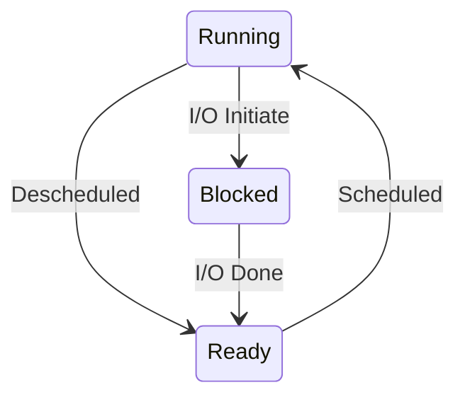

进程就是正在运行的程序。程序本身只是存储在硬盘上的指令和数据的集合，只有 OS 将其加载到内存中运行起来时程序才会发挥作用。

通常操作系统上会运行多个程序 - 比 CPU 核个数更多的程序。但每个程序并不需要关心 CPU 当前是否可用，这是因为 OS 为进程虚拟化了 CPU。OS 的基本操作是运行一个进程，然后暂停它去运行一会儿另外一个进程，这是分是运行的基本思想。<!-- more -->

为了实现 CPU 的虚拟化，OS 既需要底层的机制，也需要上层的智慧。所谓**机制 (mechanism)** 指的是实现某个功能所需要的一些底层的方法或协议。比如操作系统为了实现进程的切换，必须要有上下文切换的机制。分时运行也是一种机制，被所有的现代操作系统采用。

> **Time Sharing 和 Space Sharing**
>
> Time Sharing 是 OS 共享资源的一种基本方式，即每个人用一会儿，然后把资源交给下一个人。Time sharing 不仅仅用在多个进程/线程共享 CPU 上，共享的资源都可以使用这种机制，比如网络连接。
>
> 与 time sharing 互为补充的是 space sharing。磁盘就是一种 space sharing 的模型。

在机制之上是策略。**策略 (policy)** 是操作系统做出决定的一些算法，比如如何调度各个进程就需要一个 scheduling policy，这里有多种可能性，比如根据优先级，根据历史运行时长等等 (如果说机制是 OS 必须的东西，那么策略影响的其实只是效率)。

> **区分机制和策略**
>
> 我们可以这样区分机制和策略：机制回答的是一个 how question，比如“如何实现上下文切换？” 而策略回答的是一个 which question，比如“下一个用 CPU 的应该是哪个进程？”
>
> 区分好机制和策略，我们在修改策略时就不必关注底层的机制，更利于模块化编程。

## 4.1 The Abstraction: A Process

OS 为正在运行的程序提供的抽象是进程。进程中包括的内容当然是一个正在运行的程序所拥有的机器状态：

* Memory：每一个程序都有自己可以读写的内存区域，称为地址空间 (address space)。
* Regitsters：进程中应该有各个寄存器的信息，尤其是几个比较重要的寄存器：PC，stack pointer，frame pointer 等。
* I/O Information：程序要和可持久化存储设备打交道，因此进程会存储一些 I/O 相关信息，比如当前打开了哪些文件。

## 4.2 Process API

从抽象模型的角度，我们可以提出如下几类进程相关的 API：

* create：创建一个新的进程。
* destroy：虽然一个运行的程序结束时会自动退出，但我们仍然应该有 API 可以强制杀死一个进程。
* wait：等待一个进程结束。
* Miscellaneous Control：比如暂时挂起一个进程，或让一个进程继续运行。
* Status：访问一个进程的信息，比如总运行时长，现在处于什么状态 (running, suspended etc.) 等。

## 4.3 Process Creation: A Little More Detail

创建一个进程 (让一个程序跑起来) 通常要经过以下步骤：

* 将程序的代码和静态数据 (比如初始化过的全局变量) 加载到内存中。程序本身是以某种可执行文件的格式存放在硬盘上的 (比如 Linux 中默认使用 ELF)，文件会告诉 OS 应该把哪些代码加载到内存的哪些位置。

    早期的操作系统会 eagerly 地完成加载这个动作。但现代操作系统通常使用延迟加载：当程序真正要用到某一部分的代码/数据时再将数据从交换分区复制进来。

* 为该程序准备一个 run-time stack。以 C 程序为例，程序通常在栈上存储局部变量，此外传给 main() 的参数也保存在栈上。

* OS 准备一些空间用作该程序的堆区。堆区负责为程序中的动态内存申请提供支持，即 malloc()/free()。

* 做一些和 I/O 相关的准备工作，比如 UNIX 系统中默认为程序打开 stdin, stdout, stderr 三个文件。

* 让 PC 跳转到该程序的入口地址，开始运行。

## 4.4 Process State

进程的状态通常包括以下几种：

* Running：进程正在 CPU 上运行。
* Ready：程序可以运行，但当前不在 CPU 上。
* Blocked：程序因为做了某种操作使得当前还不能运行 (比如执行 I/O，正在等待数据返回)。

下面的图很好地反映了三种状态的切换：



OS 的调度器有很多事情要决定：比如 process 1 因为 I/O 操作被阻塞时，是否需要将其他进程 process 2切换上来？如果 process 2 运行时 I/O 操作完成，process 1 从 blocked 变成 ready，那么 OS 是将 process 1 立刻请回来还是先做 process 2？……

## 4.5 Data Structure

OS 中有很多维护信息的数据结构，比如对于进程我们应该有一个 process list，链表中的每个节点存储一个进程的相关信息，通常被称为 process control block (PCB)，再比如我们应该有上下文结构体用于 context switching。

```c
// the registers xv6 will save and restore
// to stop and subsequently restart a process
struct context {
  int eip;
  int esp;
  int ebx;
  int ecx;
  int edx;
  int esi;
  int edi;
  int ebp;
};
// the different states a process can be in
enum proc_state { UNUSED, EMBRYO, SLEEPING,
RUNNABLE, RUNNING, ZOMBIE };
// the information xv6 tracks about each process
// including its register context and state
struct proc {
  char *mem;                  // Start of process memory
  uint sz;                    // Size of process memory
  char *kstack;               // Bottom of kernel stack for this process
  enum proc_state state;      // Process state
  int pid;                    // Process ID
  struct proc *parent;        // Parent process
  void *chan;                 // If non-zero, sleeping on chan
  int killed;                 // If non-zero, have been killed
  struct file *ofile[NOFILE]; // Open files
  struct inode *cwd;          // Current directory
  struct context context;     // Switch here to run process
  struct trapframe *tf;       // Trap frame for the current interrupt
};
```

这是 xv6-x86 中的上下文结构体和 PCB。可以看到它存储了比之前提到的更多的一些信息，比如每个进程的内核栈地址，父进程，如果睡眠睡在了哪个地址上，kernel trap 的页面地址等。

进程的状态也比之间提到的 ready, running, blocked 要多。一些很有用的状态包括 zombie，它表示一个程序已经运行结束，但相关的信息还没有被清空。这种状态可以让调用 wait() 的父进程去检查子进程的返回值是否符合要求。

## 4.6 Summary

略。
